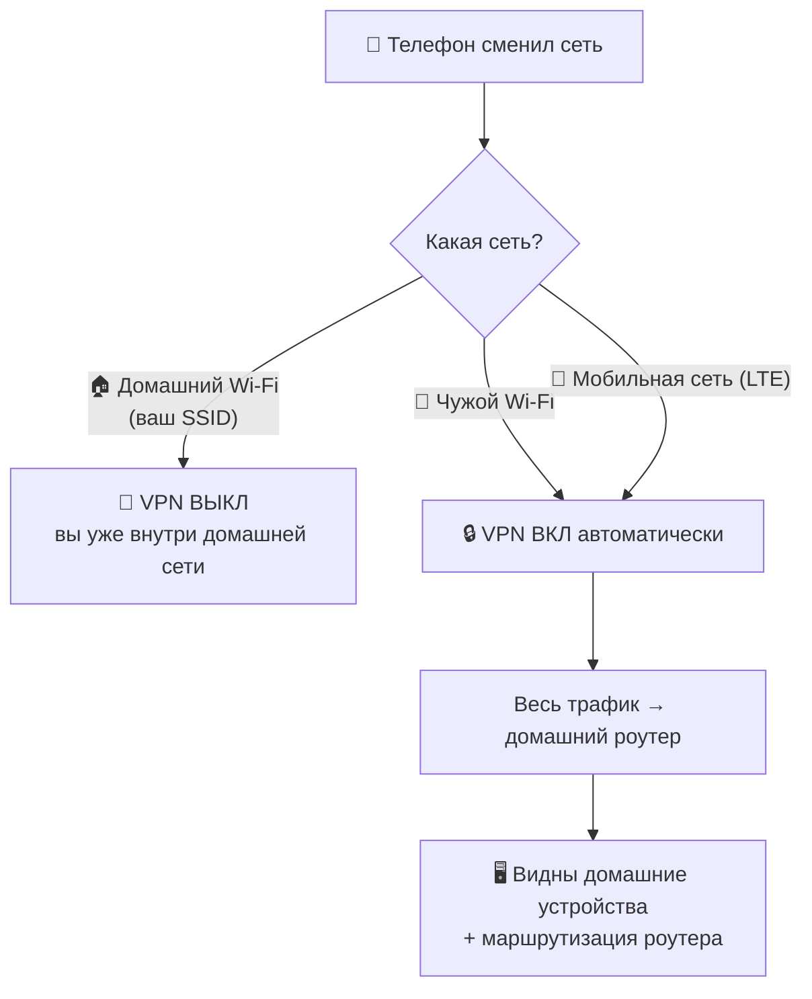
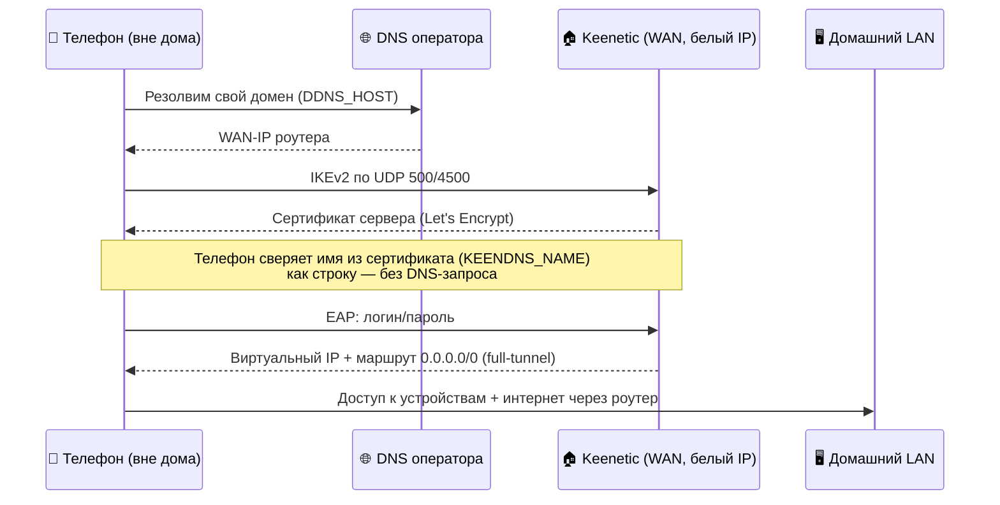

# 🏠 Home VPN на автопилоте — IKEv2/IPsec для Keenetic/Netcraze

**Роуминговый VPN `домой`, который сам понимает, где Вы находитесь.**
Настраиваете один раз — и телефон дальше всё решает сам.

> [!NOTE]
> **Главная идея простыми словами.**
> После первичной настройки вам **больше не нужно вручную включать и выключать VPN**.
> Телефон сам определяет, где он: подключён к домашнему Wi-Fi, к чужому Wi-Fi или сидит в
> мобильной сети — и на основе этого **автоматически** решает, поднимать туннель домой или нет.
> Дома VPN молчит (Вы и так в своей сети), а стоит выйти из дома или уйти в LTE — соединение
> поднимается само, без единого касания.

---

## 📑 Оглавление

- [🎯 Что это](#-что-это)
- [💡 Главная идея: VPN на автопилоте](#-главная-идея-vpn-на-автопилоте)
- [👥 Для кого это](#-для-кого-это)
- [🧩 Какие задачи решает](#-какие-задачи-решает)
- [🗂️ Что в репозитории](#️-что-в-репозитории)
- [🏗️ Как это работает](#️-как-это-работает)
- [🚀 Быстрый старт](#-быстрый-старт)
- [✅ Предварительные требования](#-предварительные-требования)
- [🛠️ Используемые технологии](#️-используемые-технологии)
- [🌟 Преимущества](#-преимущества)
- [📱 Сценарии использования](#-сценарии-использования)
- [📖 Подробная инструкция](#-подробная-инструкция)
- [❓ FAQ](#-faq)
- [🔐 Рекомендации по безопасности](#-рекомендации-по-безопасности)
- [🧯 Возможные проблемы](#-возможные-проблемы)
- [🗺️ Планы по развитию](#️-планы-по-развитию)
- [📄 Лицензия](#-лицензия)
- [📣 Telegram-канал DevOpsInTapki](#-telegram-канал-devopsintapki)

---

## 🎯 Что это

Это **не программа, а набор конфигурации и руководств** для одного практичного сценария:
сделать так, чтобы смартфон вне дома автоматически подключался к домашней сети через
роутер **Keenetic/Netcraze** по протоколу **IKEv2/IPsec**, видел домашние устройства и наследовал
маршрутизацию роутера (в том числе выборочный выход через другой VPN, если он у вас настроен).

В основе — готовый **шаблон профиля iOS** (`.mobileconfig`) и **подробный runbook**,
который можно переиспользовать для других роутеров и телефонов.

> [!TIP]
> Решение специально спроектировано для условий, где **VPN блокируется**
> (в некоторых мобильных сетях): IKEv2/IPsec в таких условиях обычно живёт,
> а как запасной канал можно держать OpenConnect поверх TLS/443.

---

## 💡 Главная идея: VPN на автопилоте

Ключевая ценность — **автоматизация**. На iOS это работает нативно через механизм
**VPN On-Demand**: правила зашиты в профиль, и система пересматривает их при каждой смене сети.



Наглядно, в двух состояниях:

```
        🏠 ДОМА                                 🧳 ВНЕ ДОМА / LTE
  ┌──────────────────┐                    ┌──────────────────┐
  │  📱  Wi-Fi:      │                    │  📱  LTE или     │
  │      ваш SSID    │                    │      чужой Wi-Fi │
  └────────┬─────────┘                    └────────┬─────────┘
           │  VPN ВЫКЛ                             │  VPN ВКЛ (сам)
           ▼                                       ▼
   прямой доступ к                          зашифрованный туннель
   домашней сети                            → 🏠 роутер → домашний LAN
                                            → маршрутизация как дома
```

> [!IMPORTANT]
> На **iOS** автоматизация полноценная (нативный On-Demand по SSID).
> На **Android** нативного триггера по SSID нет — подробности и обходные пути описаны в
> [runbook.md](runbook.md) и в разделе [Возможные проблемы](#-возможные-проблемы).

---

## 👥 Для кого это

- 🧑‍💻 Тем, кто поддерживает **домашнюю инфраструктуру** (NAS, умный дом, сервисы, медиацентр) и
  хочет иметь к ней доступ из любой точки — без ручного включения VPN.
- ✈️ Тем, кто **часто в разъездах/командировках** и хочет `быть как дома` с телефона.
- 🌍 Тем, кому важно **наследовать домашнюю маршрутизацию** (например, выборочный выход
  части трафика через сторонний VPN, настроенный на роутере).
- 🔧 Владельцам роутеров **Keenetic/Netcraze** с белым (публичным) IP.
- 🧠 Любителям DevOps/Сисадминства/самохостинга.

---

## 🧩 Какие задачи решает

| Проблема                                           | Решение в этом репозитории |
|----------------------------------------------------|---|
| Приходится вручную включать/выключать VPN          | ✅ Автоподключение по SSID (iOS On-Demand) |
| Домашний ресурс недоступен вне дома                | ✅ Full-tunnel `домой`, виден весь домашний LAN |
| Нужно повторить домашнюю маршрутизацию на телефоне | ✅ Роутер сам применяет свою логику — телефон её наследует |
| Имя роутера не резолвится в мобильной сети         | ✅ Подключение по **своему домену** (DDNS), а не по служебному имени |
| VPN режется по DPI                                 | ✅ Ставка на IKEv2/IPsec (+ запасной OpenConnect/TLS) |
| Настройку сложно повторить на другом роутере       | ✅ Переиспользуемый runbook с плейсхолдерами |

---

## 🗂️ Что в репозитории

| Файл | Назначение |
|---|---|
| [`README.md`](README.md) | Обзорная главная страница |
| [`runbook.md`](runbook.md) | 📘 Пошаговое переиспользуемое руководство с плейсхолдерами |
| [`ios-ikev2-home.mobileconfig`](ios-ikev2-home.mobileconfig) | 📱 Шаблон профиля iOS IKEv2 |

---

## 🏗️ Как это работает

Телефон подключается **не** к стороннему VPN-провайдеру, а к **Вашему роутеру**. Хитрость
IKEv2 в том, что `куда ходить` и `чей сертификат проверять` — это **два разных поля**:



**Почему нужен и свой домен, и имя KeenDNS одновременно:**

- 🌍 **Свой домен (DDNS)** — это *адрес подключения*. Он обязан резолвиться в мобильной сети
  (служебные имена вида `*.keenetic.*` у некоторых операторов отдают SERVFAIL).
- 🔏 **Имя KeenDNS** — это *идентичность сертификата* сервера (роутер получает под него
  бесплатный сертификат Let's Encrypt). Телефон сверяет его **как строку**, DNS при этом не нужен.

Полный трафик уходит в роутер (**full-tunnel**), а дальше роутер применяет **свою** политику:
что-то — в домашний LAN, что-то — в интернет, что-то — в сторонний VPN. Телефон получает
ровно то же поведение, как если бы физически стоял дома.

---

## 🚀 Быстрый старт

> [!NOTE]
> Это краткий маршрут. Полные пошаговые инструкции —
> в [runbook.md](runbook.md).

1. 🌐 **Домен.** Создайте A-запись `home.domain.ru → Ваш-WAN-IP` и проверьте `dig +short home.domain.ru`.
2. 🧩 **Роутер.** Установите на Keenetic/Netcraze компонент IKEv2/IPsec-сервера, включите его,
   выдайте доступ VPN-пользователю, оставьте NAT для клиентов включённым.
3. 🔎 **Идентичность.** Узнайте имя из сертификата сервера (`show ipsec` → `cert: "CN=..."`).
4. 📱 **iPhone.** Возьмите [`ios-ikev2-home.mobileconfig`](ios-ikev2-home.mobileconfig),
   подставьте свои значения вместо плейсхолдеров `{{...}}`, сгенерируйте `PayloadUUID` (`uuidgen`),
   проверьте `plutil -lint` и установите профиль на телефон.
5. 🤖 **Android.** Настройте strongSwan (смотрите runbook).
6. ✅ **Проверка.** Выйдите из домашнего Wi-Fi — туннель должен подняться сам.

```
  создать домен  →  включить сервер  →  узнать CN сертификата
        │                                        │
        ▼                                        ▼
  заполнить {{...}} в профиле  →  установить на iPhone  →  🎉 автоподключение
```

---

## ✅ Предварительные требования

- 🌐 **Публичный (белый) IP** на WAN роутера — не CGNAT. (Проверяется в интерфейсе роутера.)
- 📛 **Свой домен** с возможностью управлять A-записью (для стабильного адреса подключения).
- 🧭 **Роутер Keenetic/Netcraze** с поддержкой компонента IKEv2/IPsec-сервера и KeenDNS (для сертификата).
- 👤 **Учётная запись на роутере** с доступом к VPN-серверу.
- 📱 **iPhone/iPad** (для нативного автоподключения) и/или **Android** с приложением strongSwan.
- 🍏 Для правки/проверки профиля удобны macOS-утилиты `plutil` и `uuidgen` (есть `из коробки`).

> [!TIP]
> Если WAN-IP динамический — заранее продумайте **автообновление DDNS**
> (это отмечено в [Планах по развитию](#️-планы-по-развитию)).

---

## 🛠️ Используемые технологии

| Технология                                        | Роль в решении                                                       |
|---------------------------------------------------|----------------------------------------------------------------------|
| **IKEv2/IPsec**                                   | Основной VPN-протокол, хорошо переживает DPI, поддерживается нативно |
| **EAP-MSCHAPv2**                                  | Аутентификация клиента по логину/паролю                              |
| **VPN On-Demand (iOS)**                           | Автоподключение/отключение по текущему Wi-Fi SSID и типу сети        |
| **Apple Configuration Profile** (`.mobileconfig`) | Декларативная настройка VPN и правил на iOS                          |
| **Keenetic/Netcraze / Keenetic/NetcrazeOS**       | Домашний роутер и встроенный IKEv2/IPsec-сервер                      |
| **KeenDNS + Let's Encrypt**                       | Бесплатный TLS-сертификат и идентичность сервера                     |
| **DDNS (свой домен)**                             | Резолвищийся в мобильной сети адрес подключения                      |
| **strongSwan (Android)**                          | IKEv2-клиент с возможностью задать идентичность сервера отдельно     |
| **Full-tunnel + policy routing**                  | Наследование домашней маршрутизации телефоном                        |

---

## 🌟 Преимущества

- 🤖 **Автоматизация.** Ноль ручных действий после настройки (на iOS).
- 🏠 **`Как дома` откуда угодно.** Виден LAN, работает домашняя маршрутизация.
- 🔒 **Свой сервер, свои данные.** Трафик идёт через Ваш роутер, а не через чужой сервис.
- 🧱 **Устойчивость к DPI.** IKEv2 там, где многое блокируют.
- 💸 **Без абонплаты.** Используются возможности роутера и бесплатный сертификат.
- 📱 **Родные средства ОС.** На iOS — штатный механизм, без сторонних приложений.
- ♻️ **Воспроизводимость.** Шаблон + runbook переносятся на другие роутеры/телефоны.

---

## 📱 Сценарии использования

- 🧳 **Командировка/отпуск:** телефон в LTE автоматически `дома` — доступ к сервисам и файлам.
- ☕ **Публичный Wi-Fi:** на чужой сети трафик автоматически уходит в доверенный домашний туннель.
- 🎯 **Выборочная маршрутизация:** часть трафика идёт через сторонний VPN на роутере — телефон
  наследует это правило без отдельной настройки.
- 🖥️ **Доступ к домашним устройствам:** NAS, камеры, умный дом, админки — по внутренним адресам.
- 🔁 **Мультиустройство:** одна и та же схема для iPhone и Android.

---

## 📖 Подробная инструкция

Полное пошаговое руководство (установка компонента, настройка сервера, разбор профиля
построчно, iOS, Android + Tasker, проверка и типовые ошибки) — в отдельном файле:

### 👉 [**runbook.md**](runbook.md)

> [!NOTE]
> README намеренно остаётся обзорным. Все детали, команды и построчные комментарии
> живут в `runbook.md`, чтобы не дублировать информацию.

---

## ❓ FAQ

<details>
<summary><b>Почему нельзя подключаться по служебному имени роутера (например, keenetic.link)?</b></summary>

Потому что в некоторых мобильных сетях такие имена **не резолвятся** (DNS оператора отдаёт
SERVFAIL). Поэтому адресом подключения выступает **Ваш собственный домен** с A-записью на
WAN-IP роутера.
</details>

<details>
<summary><b>Тогда зачем вообще нужен KeenDNS?</b></summary>

KeenDNS выступает `фабрикой сертификата`: под его имя роутер получает бесплатный сертификат
Let's Encrypt. Это имя используется только как **идентичность сервера** (сравнение строки),
и телефон его **не резолвит**. Подробнее — в [разделе «Как это работает»](#️-как-это-работает).
</details>

<details>
<summary><b>На Android работает так же автоматически, как на iPhone?</b></summary>

Нет. В Android **нет нативного триггера VPN по SSID**. Есть либо режим `постоянный VPN`
(включён всегда), либо автоматизация через сторонние инструменты (Tasker + AutoInput), которая
менее надёжна. Рекомендуемый вариант — ручной ярлык подключения. Детали — в `runbook.md`.
</details>

<details>
<summary><b>Нужен ли `белый` IP?</b></summary>

Да. Для входящих VPN-подключений роутер должен быть доступен из интернета (публичный IP, не CGNAT).
</details>

<details>
<summary><b>Почему IKEv2, а не WireGuard?</b></summary>

WireGuard в ряде мобильных сетей активно блокируют по сигнатуре. IKEv2/IPsec
в таких условиях обычно продолжает работать.
</details>

<details>
<summary><b>Безопасно ли хранить пароль прямо в профиле?</b></summary>

Заполненный профиль содержит пароль в открытом виде — относитесь к нему как к секрету.
Можно **не указывать** пароль в профиле: тогда iOS запросит его один раз при подключении.
Смотрите [Рекомендации по безопасности](#-рекомендации-по-безопасности).
</details>

---

## 🔐 Рекомендации по безопасности

- 🙈 **Пароль можно не хранить в профиле** — удалите строку `AuthPassword`, и iOS спросит его при подключении.
- 👤 **Отдельная учётная запись** под VPN с ограниченными правами и **надёжным** паролем.
- 🔐 **Не выключайте проверку сертификата** — доверие обеспечивается цепочкой Let's Encrypt.
- 🧹 **Меняйте пароли**, которые могли `засветиться` при отладке или в логах.

---

## 🧯 Возможные проблемы

| Симптом                                              | Вероятная причина                               | Что делать                                                |
|------------------------------------------------------|-------------------------------------------------|-----------------------------------------------------------|
| `no matching peer config found` в логе роутера       | `RemoteIdentifier` ≠ имя из сертификата         | Возьмите точное `CN` из `show ipsec` и впишите его        |
| Туннель не поднимается, хотя шифрование согласовалось | Неверный пароль или у учётки нет доступа к IKEv2 | Проверьте пароль и права учётной записи                   |
| Телефон не резолвит адрес в LTE                      | Использовано служебное имя вместо своего домена | Подключайтесь по своему DDNS-домену                       |
| В веб-интерфейсе роутера нет компонента VPN-сервера  | Трафик к облаку роутера уходит в сторонний VPN  | Не заворачивайте домены роутера в VPN/policy-маршрут      |
| На Android VPN не включается `сам`                    | Нет нативного SSID-триггера                     | Ярлык подключения или Tasker+AutoInput (смотрите runbook) |
| Соединение рвётся при смене WAN-IP                   | DDNS не обновляется                             | Настройте автообновление DDNS (смотрите планы)            |

> [!TIP]
> Развёрнутый разбор ошибок и проверок — в разделе `Быстрая проверка и типовые грабли`
> файла [runbook.md](runbook.md).

---

## 🗺️ Планы по развитию

Эти пункты **пока не реализованы** в репозитории и рассматриваются как направления развития:

- [ ] 🤖 **Android:** довести автоподключение по SSID (ярлык / Tasker) до готового рецепта.
- [ ] 🔁 **Автообновление DDNS** на случай смены динамического WAN-IP.
- [ ] 🧰 **Шаблон для Android** (пример конфигурации strongSwan) по аналогии с iOS-профилем.
- [ ] 🧪 **Скрипт валидации** профиля (`plutil -lint`) и подстановки плейсхолдеров.
- [ ] 📂 **Структура каталогов** (`ios/`, `android/`, `router/`, `docs/`) — смотрите рекомендации ниже.
- [ ] 🖼️ **Скриншоты** шагов настройки на iOS/роутере.
- [ ] 📄 **Файл лицензии**.

---

## 📄 Лицензия

MIT License

---

## 📣 Telegram-канал DevOpsInTapki

Если вам близки темы из этого репозитория — **DevOps, Linux, VPN, Kubernetes, Ansible,
автоматизация и домашняя инфраструктура** — заглядывайте в мой Telegram-канал
**[DevOpsInTapki](https://t.me/DevOpsInTapki)**. Там я делюсь практическими заметками,
разбором подобных задач и находками — по-домашнему и по делу.

Подписка необязательна, но будет приятно видеть единомышленников. 🙂

---

<div align="center">

Сделано с ❤️ для тех, кто любит, когда домашняя инфраструктура работает сама.

</div>
